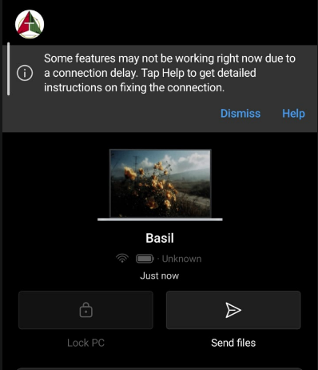

# Microsoft Phone Link Camera Fix

This utility fixes the issue in Microsoft Phone Link where a message appears regarding connection delays on your phone ("some features may not be working right now due to a connection delay...").



The script restarts the Bluetooth and phone services and also repairs the Windows Phone Link app to resolve the issue.

## Usage

Download and run the `FixPhoneLinkCamera.bat` file.

Or run the following command in your terminal:

```cmd
cmd /c 'curl -sL "https://raw.githubusercontent.com/basilbenny1002/microsoft-phone-link-camera-fix/main/FixPhoneLinkCamera.bat" -o "%temp%\fix.bat" && start /wait "" "%temp%\fix.bat" && del "%temp%\fix.bat"'
```
